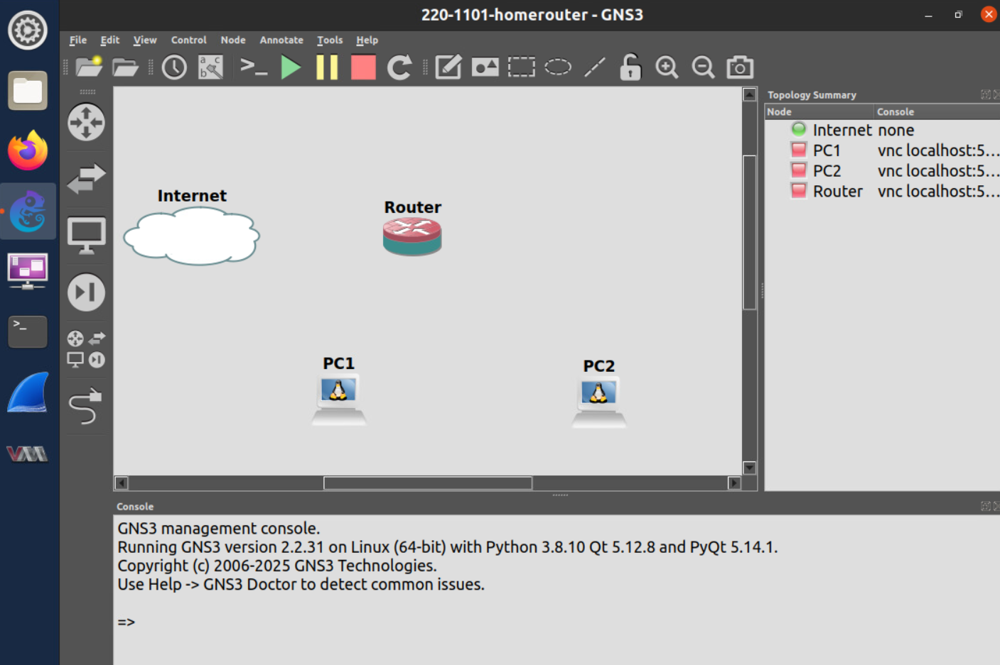
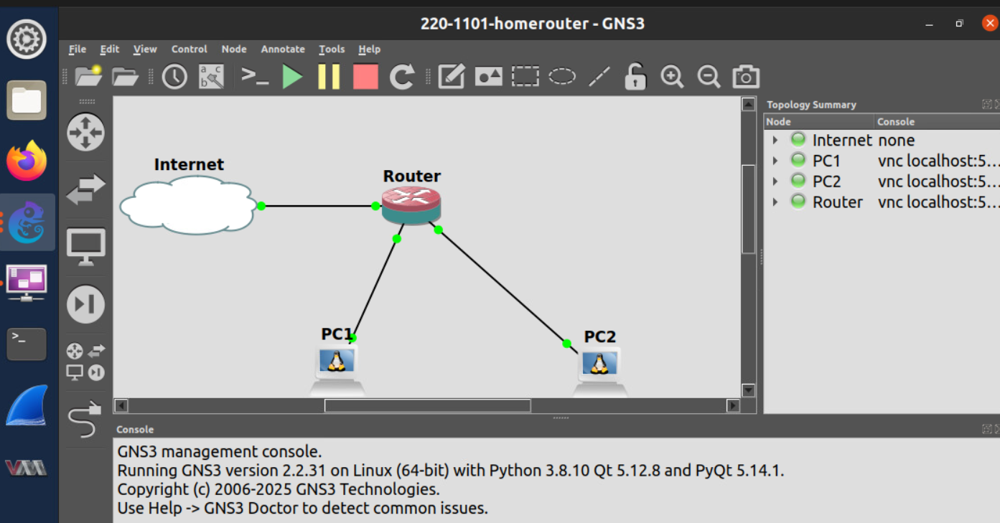
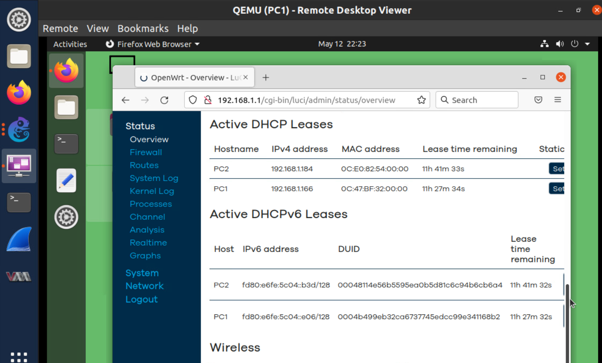
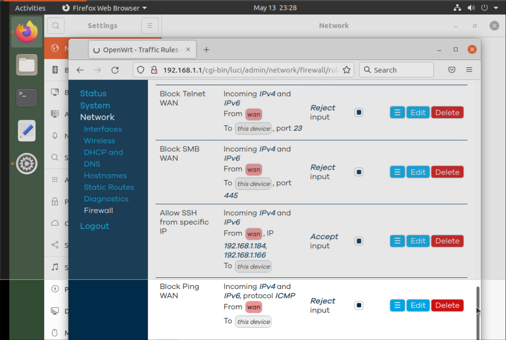

# 🛠️ SOHO Router Configuration Project (GNS3 + OpenWRT)

This project simulates the setup, configuration, and validation of a Small Office/Home Office (SOHO) network using virtual networking tools. The lab was created using GNS3 and OpenWRT to mirror a realistic home or small business environment.

The goal was to design a functioning LAN with a router, two client devices, and internet access — while also applying secure configurations such as DHCP, firewall rules, and connectivity testing. 

---

## 📚 Project Objectives

- 🖥️ Build a virtual network using GNS3 with a router and multiple client devices.
- ⚙️ Configure an OpenWRT router to assign IP addresses using DHCP.
- 🔐 Apply firewall rules to restrict unsafe traffic like Telnet, SMB, and external pings.
- 📡 Test LAN communication using ICMP (`ping`) to validate connectivity.
- 💡 Document each step visually and technically, just like a real IT project report.

---

## 🧰 Tools & Technologies Used

- **GNS3** — to build and emulate the virtual SOHO network.
- **OpenWRT** — to simulate a professional-grade router interface.
- **Virtual PCs (PC1 & PC2)** — to act as client endpoints on the LAN.
- **Ping Utility** — for basic network diagnostics and validation.
- **DHCP Protocol** — to automatically assign IP addresses to clients.

---

## 🖼️ Screenshots

### 1. Initial Network Topology

> This diagram shows the unconnected layout in GNS3, with one router, two PCs, and a simulated internet/cloud node. It represents the starting point before configuration.

---

### 2. Final Connected Topology

> The router and clients are now connected via virtual links. This confirms that the network was properly wired in the GNS3 environment and is ready for logical configuration.

---

### 3. DHCP Lease Table from Router

> The OpenWRT router automatically issued both IPv4 and IPv6 addresses to PC1 and PC2 using its built-in DHCP service. This confirms dynamic address assignment is working properly and the clients are communicating with the router.

---

### 4. Firewall Rules Configuration

> This screenshot shows custom firewall rules configured in OpenWRT. Rules were set to block Telnet, SMB, and ping (ICMP) from the WAN side, while allowing internal SSH access. This simulates basic but important SOHO network protection.

---

### 5. Ping Test to Verify Connectivity

> PC1 successfully pinged PC2 on the same network, confirming that local device communication is fully functional. All packets were received with 0% loss, indicating a healthy LAN environment.

---

## ✅ Summary & Reflection

This project was a hands-on simulation of setting up a real-world SOHO (Small Office/Home Office) network. By designing a full virtual topology, configuring router services, securing traffic with firewall rules, and validating connections through tests, I developed a more practical understanding of how network infrastructure operates from the ground up.

### 🧠 Key Skills Demonstrated:
- ✅ Network topology design and configuration using GNS3
- ✅ Router setup with OpenWRT, including DHCP and firewall customization
- ✅ Understanding of IP addressing and dynamic assignment via DHCP
- ✅ Use of basic network diagnostics (`ping`) to validate device connectivity
- ✅ Logical troubleshooting and verification of system behavior

---

### 💭 Reflection

Before starting this lab, I had a theoretical understanding of networking concepts like DHCP, firewall rules, and LAN topology. But this project helped me bridge that gap between **concept and application**.

What stood out most was realizing how **each layer of the network builds on the other** — for example, even a simple misconfigured DHCP rule can prevent all devices from talking, and a careless firewall rule can block legitimate traffic. Setting up firewall rules in OpenWRT also gave me insight into how real-world routers balance **access vs. security**.

Overall, this project taught me not just how to **set up a network**, but how to think **logically through configuration issues** and verify the results step by step — skills that are essential in IT support, networking, or cybersecurity roles. This experience gave me more confidence in working with routers, diagnosing connectivity problems, and documenting my work like a professional.
